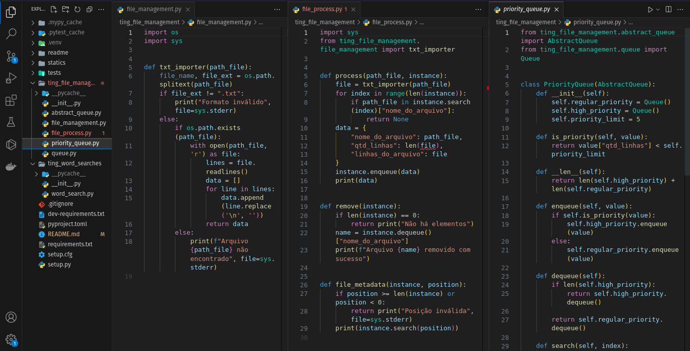

# Ting



# Índice

* [Título e Imagens Home](#ting)
* [tecnologias utilizadas](#tecnologias-utilizadas)
* [Descrição do projeto](#descrição-do-projeto)
* [Status do Projeto](#status-do-projeto)
* [Funcionalidade do projeto](#🔨-funcionalidade-do-projeto)
* [Acesso ao Projeto](#acesso-ao-projeto)

# Tecnologias utilizadas


# Descrição do Projeto

O projeto "Ting" é parte do currículo da formação de Desenvolvedor Web da [Trybe](https://www.betrybe.com/). Nesse projeto, os alunos têm a oportunidade de aplicar seus conhecimentos Linguagem Python com tratamento de arquivos.

# Status do Projeto

> 💹 Alpha 💹

# 🔨 Funcionalidade do projeto

- ler um Arquivo

# Acesso ao projeto

Para acessar e executar este projeto, siga os passos abaixo:

1. Certifique-se de ter o Python3 e o pip instalados em sua máquina.

2. Clone o Projeto

```bash
git clone https://github.com/EversonDias/Ting_with_Python.git Ting
```

3. Entre no projeto

```bash
cd Ting
```

4. Instale as Dependências

```bash
python3 -m pip install -r dev-requirements.txt
```

5. inicie o projeto

Em Construção
